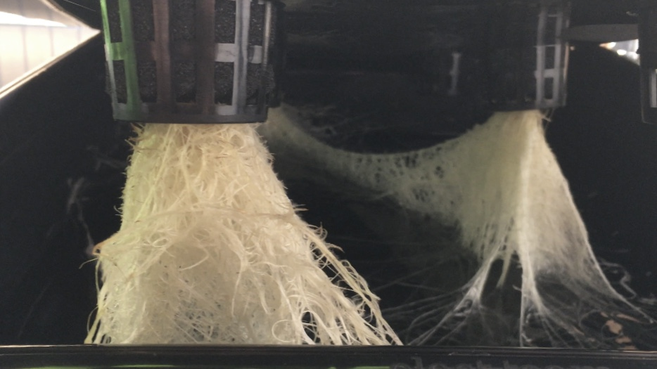

# Simple Fab Hydroponics

*June 2022*

Techniques and design files for static hydroponic growing of salad or other pants in a Fab Lab. System and 3D design by [Knut Klo](http://klo.no/), additional design ideas by [Haakon Karlsen Jr](https://www.vikingcabins.com/copy-of-amenities) and Jens Dyvik.

Growth of a lettuce pant

Brainstorming at Fab Lab Lyngen

### What to buy

* LED light source https://ledlyskilder.no/vekstlys/3738-ledlife-helios-vekstlampe-150w-ip65-inkl-oppheng-fullt-lysspektrum-uten-vifte-dimbar-lysstyrke-5744002523345.html
* Rockwool for sprouting https://www.gartnerbutikken.no/products/brett-med-rockwoolkuber
* Fertilizer https://www.hageartikler.no/products/maxiseries
* A box to grow in https://www.auer-packaging.com/no/no/Eurokasser-uten-hull/EG-6417-HG.html
* A small box to sprout in (old icecream box? needs to be black/dark to protect from light) https://www.nelsongarden.no/no/forkultivering/minidrivhus-og-potter/spirekasse-solid-p5770/

### What to 3D print

* [Rockwool holder](https://github.com/JensDyvik/simple-fab-hydroponics/blob/main/stl-files-for-3d-printing/GrodanGroCup_v05-trimmed.stl)
* [Sprout yurt](https://github.com/JensDyvik/simple-fab-hydroponics/blob/main/stl-files-for-3d-printing/sprout-yurt-for-spiral-vase-printing.stl) (for covering seed from light in while sprouting) 

### What to CNC mill, laser cut or drill and saw

A box cover for sprout case and grow case (or drill ø50mm holes in the lid). Coming soon (see pics further down)

Laser cut a top plate for the sprout box or drill ø50mm holes in a lid or plate

### How to sprout

3D print one [Rockwool holder](https://github.com/JensDyvik/simple-fab-hydroponics/blob/main/stl-files-for-3d-printing/GrodanGroCup_v05-trimmed.stl) and [Sprout yurt](https://github.com/JensDyvik/simple-fab-hydroponics/blob/main/stl-files-for-3d-printing/sprout-yurt-for-spiral-vase-printing.stl) per plant you are going to grow.

Place the rockwool cubes into the 3D printed holders. The top of the rockwool should be flush with the holder.

Add water to the sprout box. The water level should be about 1cm above the bottom of the rockwool so that the rockwool can soak up the water.

Place a seed on top of each rockwool cube

Wet your finger tip to make it easier to pick up seeds

Push the seeds into the small hole. It should touch the sides of the hole

Cover the seeds with the sprouting yurts for one week. After about another week the sheets should be ready beeing moved to the growing box

The seeds that we sprouted in Fab Lab Lyngen in June 2022

### How to grow

- Check PH levels in your tap water. Adjust until PH is 5.5?
- Mix fertilizer with water
- Add water to grow box. The waterlevel should be about 1cm bellow the rockwool grodan (only the root should be in the fertilized water)
- Transfer the 3D printed rockwool holders with the sprouts from the sprout box to the holes in the lid of the growbox,
- Make sure no light can reach the water (aluminum foil can be a quick way to cover white/transparent boxes or lids)
- Add light source and timing cycle
- If all is well you can leave plants alone untill ripe for harvesting

More details and pics coming soon

### How to harvest and restart

Coming sooon

### To do

 - Add more details to growth documention
 - Fix dimensions of freecad design file of the rockwool https://github.com/JensDyvik/simple-fab-hydroponics/blob/main/cad-files/rockwool-holder.FCStd
 - Test growing in 5l bottle
 - Test growing in the soon to be built greenhouse at Fab Lab Lyngen
